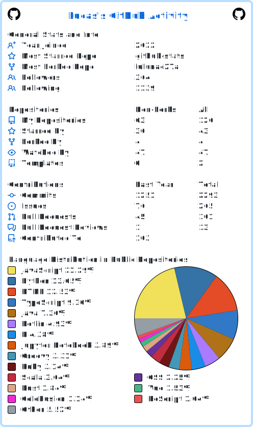

# About Me
I am smart, intelligent, good at computers, math, and programming, and I like astronomy and space.
# My GitHub Stats

<b>Show My GitHub Stats</b>

<b>GitRoll Profile</b>

  

<b>Developer Contribution Card</b>

  

    

<b>GitHub View Counter</b>

  

<b>User Statistician</b>

<b>GitHub Readme Stats</b>

<b>GitHub Trophy Stats</b>

<b>GitHub Profile Activity Summary</b>

<b>GitHub Metrics</b>

<b>Code::Stats Readme</b>

<b>GitHub Stats</b>

<b>Developer Power Meter Stats</b>

<b>GitHub Readme Streak Stats</b>

<b>GitRanks Rankings</b>

 
 

