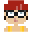

# 🚀 My Termonaut Profile

*Gamified terminal productivity tracking*

## 📊 Badges

     

## 🎨 Profile & Stats

<table><tr>
<td width="40%" align="center">

### 👤 Avatar

</td>
<td width="60%">

### 📊 Stats Overview

**Level**: 1 (XP: 0)  
**Total Commands**: 0  
**Unique Commands**: 0  
**Current Streak**: 0 days  
**Longest Streak**: 0 days  
**Commands Today**: 0  

</td>
</tr></table>

## 🏆 Achievements

- ⏳ **First Steps**: Execute your first command
- ⏳ **Command Master**: Execute 1000 commands

*0/2 achievements unlocked*

---

*Generated by [Termonaut](https://github.com/oiahoon/termonaut) - Terminal productivity tracker*
*Last updated: February 3, 2026*
